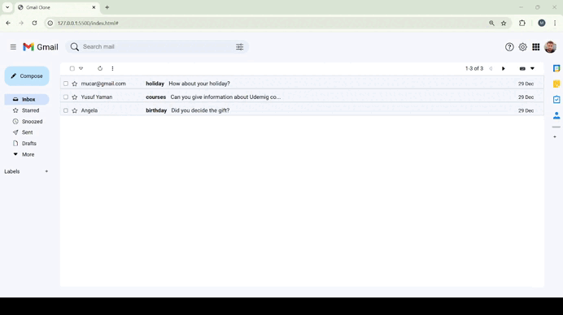

# Gmail Clone Project
In this project, I exercised the features of adding, searching, filtering, staring and deleting items. It was a great project to reinforce the basic features of Javascript.
# Preview of the Project

